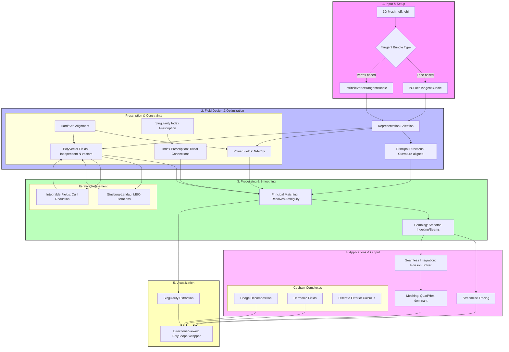

# Directional - A Directional Field Processing Library

Directional is a C++ library for creating, manipulating, and visualizing directional fields on 3D meshes. It provides a comprehensive framework for working with various types of directional fields including polyvector fields, power fields, and raw fields, with support for visualization, field manipulation, and geometric analysis.

## Why Vector Fields Matter

Directional fields on triangle meshes are fundamental to many geometry processing and computer graphics applications. They provide a systematic way to define orientations across surfaces that enable:

### Key Applications

| Application | How Vector Fields Help |
|-------------|---------------------|
| **Quad-dominant Meshing** | Vector fields guide quad/triangle face generation for quality remeshing |
| **Texture Synthesis** | Fields define UV parameterization and pattern alignment directions |
| **Surface Parameterization** | Seamless parameterizations require consistent field directions |
| **Surface Deforming** | Directional constraints maintain feature alignment during morphing |
| **Flow Visualization** | Streamlines trace field flow patterns for data visualization |
| **Architectural Design** | Controlled singularities enable geodesic and panel layouts |
| **Anisotropic Processing** | Direction-dependent operations follow field geometry |
| **Simulation Setup** | Flow fields drive fluid/heat simulation initial conditions |

### Singularities and Topology

Vector fields naturally contain **singularities** - points where the field direction becomes undefined or wraps around. These singularities are:

- Fundamentally tied to mesh topology (Gauss-Bonnet theorem)
- Essential for achieving desired global field configurations
- Useful for creating intentional cuts in parameterization
- Critical for quad-mesh generation where poles become mesh vertices

---

## Complete Pipeline



**Pipeline Stages:**

1. **Input**: Load triangle mesh in OBJ format
2. **Field Computation**: Generate power/polyvector/raw field
3. **Conversion**: Transform between field representations
4. **Matching**: Compute correspondences between tangent spaces
5. **Combing**: Reorder vectors for consistency across edges
6. **Downstream**: Use for visualization or mesh processing

### Quick Start (CLI)

```bash
# Build apps
cd app && mkdir build && cd build
cmake .. && make

# Generate 4-directional power field
./power_field_app_bin input.obj field.field 4

# Convert to raw format
./power_to_raw_app_bin input.obj field.field raw.field 4

# Compute matching
./principal_matching_app_bin input.obj raw.field matching.out

# Comb field
./combing_app_bin input.obj raw.field combed.field matching.out
```

## Key Features

- **Multiple Field Representations**: Support for PolyVector fields, Power fields, and Raw fields with smooth interpolation across mesh elements
- **Discrete Exterior Calculus**: Comprehensive operators including gradient, divergence, curl, and Hodge decomposition
- **Tangent Bundle Management**: Intrinsic and extrinsic tangent bundle representations for field computation
- **Field Visualization**: Integration with Polyscope for interactive visualization of fields, streamlines, isolines, and glyphs
- **Field Operations**: Combing, matching, curl projection, and index prescription for field manipulation
- **Meshing Capabilities**: Support for generating meshes and working with polygonal elements

## Components

### Core Data Structures

#### TriMesh (`TriMesh.h`)
The fundamental mesh class storing triangle meshes with connectivity information including vertices, faces, edges, and their relationships. Provides DCEL-based data structure for efficient topological queries.

- **Practical Applications**: Base mesh representation for all field operations, mesh analysis, and visualization

#### TangentBundle (`TangentBundle.h`)
Abstract base class for discrete tangent bundles, representing the underlying space where directional fields live. Includes both intrinsic and extrinsic representations.

- **Practical Applications**: Foundation for field computation, supports face-based and vertex-based tangent spaces

#### CartesianField (`CartesianField.h`)
Represents directional fields as collections of vectors in tangent spaces. Supports multiple field types including PolyVector, Power, and Raw fields with optional matching information.

- **Practical Applications**: Storing and manipulating computed directional fields for further processing or visualization

### Field Computation

#### PolyVector Fields (`polyvector_field.h`, `PolyVectorData.h`)
Computes N-directional fields (N-RoSy) using polyvector representation. Supports soft and hard constraints, smooth interpolation, and reduction to lower-order representations.

- **Practical Applications**: Computing smooth directional fields with specific singularity patterns, direction field design for quadrangulation and texturing

#### Power Fields (`power_field.h`)
Computes power fields as complex-valued functions raised to Nth power. Provides an alternative representation for N-directional fields with computational advantages.

- **Practical Applications**: Direction field design, field simplification, and conversion between field representations

#### Raw Fields (`raw_to_polyvector.h`, `polyvector_to_raw.h`)
Conversion between different field representations. Raw fields store vectors without implicit symmetry.

- **Practical Applications**: Field format conversion, low-level field manipulation

### Field Manipulation

#### Combing (`combing.h`)
Reorders vectors in tangent spaces to achieve consistent matching across mesh edges, identifying seams where field continuity breaks.

- **Practical Applications**: Preparing fields for parameterization, identifying singularities, field visualization

#### Principal Matching (`principal_matching.h`)
Computes correspondence between vector sets across adjacent tangent spaces based on alignment.

- **Practical Applications**: Field connectivity analysis, singularity detection

#### Index Prescription (`index_prescription.h`)
Prescribes the index (turn number) of singularities in directional fields.

- **Practical Applications**: Controlling field topology, creating fields with specific singularity configurations

### Geometric Operators

#### Discrete Exterior Calculus (`discrete_exterior_calculus.h`)
Provides differential operators on meshes:
- `d0_matrix`: Gradient operator (edges to vertices)
- `d1_matrix`: Curl operator (faces to edges)
- Hodge star operators for dual complexes

- **Practical Applications**: Solving PDEs on meshes, computing vector field decompositions

#### Gradient Matrices (`gradient_matrices.h`)
Computes gradient operators for functions defined on mesh elements.

- **Practical Applications**: Function analysis, numerical solving

#### Curl Matrices (`curl_matrices.h`)
Computes curl operators for vector fields on meshes.

- **Practical Applications**: Vector field analysis, computing circulation

#### Divergence Matrices (`div_matrices.h`)
Computes divergence operators for vector fields.

- **Practical Applications**: Fluid dynamics simulation, field decomposition

#### Mass Matrices (`mass_matrices.h`)
Computes mass matrices for discretization of integration over mesh elements.

- **Practical Applications**: Finite element methods, energy minimization

#### Project Curl (`project_curl.h`)
Projects curl of a vector field onto a set of faces while respecting prescribed matching.

- **Practical Applications**: Field refinement, curl-based field design

### Visualization Components

#### Streamlines (`streamlines.h`, `branched_isolines.h`)
Traces streamlines through directional fields with support for branching at singularities.

- **Practical Applications**: Visualizing flow patterns, texture synthesis direction visualization

#### Isolines (`isolines.h`)
Computes isolines (level sets) of scalar functions on meshes.

- **Practical Applications**: Scalar field visualization, function analysis

#### Branched Gradient (`branched_gradient.h`)
Computes branched vector fields from gradient fields that respect singularities.

- **Practical Applications**: Creating seamless parameterizations, field visualization with singularities

### Mesh Operations

#### Cut Mesh with Singularities (`cut_mesh_with_singularities.h`)
Cuts mesh along singularity curves to create a globally consistent field.

- **Practical Applications**: Field-aware mesh cutting, parameterization

#### Polygonal Edge Topology (`polygonal_edge_topology.h`)
Analyzes topology of polygonal meshes and their edge structures.

- **Practical Applications**: Polygonal mesh processing, advanced meshing

#### Mesher (`mesher.h`, `NFunctionMesher.h`)
Generates meshes optimized for specific purposes or from implicit functions.

- **Practical Applications**: Mesh generation, remeshing, creating meshes for simulation

### Utilities

#### I/O Operations
- `readOBJ.h` / `writeOBJ.h`: Read/write OBJ mesh files
- `readOFF.h` / `write_raw_field.h`: Read/write field data
- `read_singularities.h` / `write_singularities.h`: Read/write singularity data
- `read_matching.h` / `write_matching.h`: Read/write matching data

#### Mathematical Utilities
- `sparse_identity.h`, `sparse_diagonal.h`, `sparse_block.h`: Sparse matrix operations
- `matrix_slice.h`: Matrix extraction operations
- `set_diff.h`: Set operations

#### Viewer Integration (`directional_viewer.h`)
Provides integration with Polyscope for interactive visualization of meshes and fields.

## Practical Applications

### Direction Field Design
Create smooth N-directional fields on meshes for applications in quadrangulation, texture synthesis, and surface parameterization. The library supports hard constraints (fixed directions) and soft constraints (weighted preferences).

### singularity Analysis
Identify and manipulate singularities in directional fields. The combing operation helps visualize singularity locations while index prescription allows controlling field topology.

### Vector Field Decomposition
Using discrete exterior calculus, decompose vector fields into gradient, curl, and harmonic components. This is fundamental for analyzing flow patterns and solving PDEs on surfaces.

### Surface Parameterization
Create seamless parameterizations by cutting along singularity curves and computing globally consistent fields. The branched gradient enables parameterizations with singularity control.

### Flow Visualization
Trace streamlines through vector fields to visualize flow patterns. Support for branched streamlines handles singularities gracefully.

### Mesh Generation
Generate quality meshes from implicit functions or remesh existing meshes for specific applications.

## Installation

Directional requires:
- C++ compiler with C++14 support
- [Eigen](http://eigen.tuxfamily.org/) for linear algebra
- [Polyscope](https://github.com/nicholaskariniemi/polyscope) for visualization (optional)

Clone the repository and build using CMake:

```bash
mkdir build
cd build
cmake ..
make
```

## Usage Example

```cpp
#include <directional/TriMesh.h>
#include <directional/PCFaceTangentBundle.h>
#include <directional/power_field.h>
#include <directional/directional_viewer.h>

// Load mesh
directional::TriMesh mesh;
directional::readOBJ("mesh.obj", mesh.V, mesh.F);

// Create tangent bundle
directional::PCFaceTangentBundle tb;
tb.init(mesh);

// Compute power field
directional::CartesianField field;
directional::power_field(tb, {}, {}, {}, 4, field);

// Visualize
directional::viewField(field);
```

## Citation

If you use Directional in your research, please cite:

```bibtex
@misc{Directional,
  author = {Amir Vaxman},
  title = {Directional: A Directional Field Processing Library},
  year = {2021},
  publisher = {GitHub},
  journal = {GitHub repository},
  howpublished = {\url{https://github.com/avaxman/Directional}}
}
```

Directional received the SGP 2021 Software Award.

## License

Mozilla Public License v. 2.0 - See LICENSE file for details.
